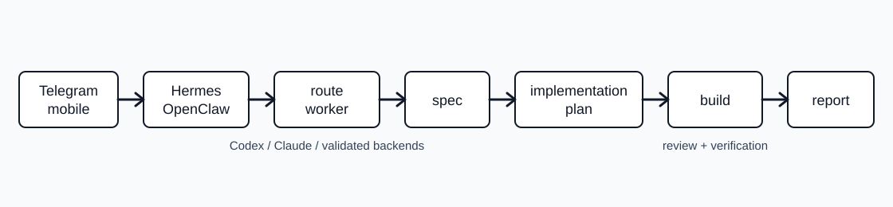

`basd-coding-dispatch` is a native Hermes/OpenClaw coding-dispatch skill for approval-gated coding from Telegram and mobile chat.

[](https://github.com/damienen/basd-coding-dispatch/actions/workflows/ci.yml)
[](https://www.npmjs.com/package/basd-coding-dispatch)
[](LICENSE)
[](https://github.com/damienen/basd-coding-dispatch/releases)

Run serious coding work from your phone without letting the agent skip process. A Telegram message can enter your Hermes gateway, load this skill, classify the task, ask for the right approvals, route implementation to Codex or Claude worker backends, enforce quality gates, force independent review when it matters, and report only after verification evidence exists.

Hermes is the maintained home for v0.1. OpenClaw users can use the same workflow as a workspace skill. Provider neutrality remains real, but it is a backend worker-routing mechanism rather than the headline: the dispatcher owns the gates, and Codex, Claude, or another validated backend does the work.

## Workflow

```text
Telegram / mobile request
  -> Hermes gateway or OpenClaw workspace skill
  -> classify task
  -> choose worker-routing: Codex / Claude / split
  -> spec gate
  -> implementation-plan gate
  -> implementation
  -> subagent review
  -> verification
  -> report
```



## Prerequisites

- Hermes or OpenClaw is already installed and authenticated for the runtime you plan to use.
- Codex CLI and Claude Code are already installed and authenticated if you want Hermes/OpenClaw to route worker tasks to those backends.
- Node.js 22 or newer is available for `npx basd-coding-dispatch`.

## Quickstart

Install the full Hermes skill directory (default target):

```bash
npx basd-coding-dispatch init
```

Install into a specific Hermes home:

```bash
npx basd-coding-dispatch init --dir ~/.hermes
```

Install for OpenClaw workspace skills:

```bash
npx basd-coding-dispatch init --target openclaw --dir ~/openclaw-workspace
```

Skip default companion skills:

```bash
npx basd-coding-dispatch init --skip-companion-skills
npx basd-coding-dispatch init --target openclaw --no-companion-skills
```

Create the manual project scaffold for a generic agent:

```bash
npx basd-coding-dispatch init --target generic-agent --dir ./project
```

Inspect local install status:

```bash
npx basd-coding-dispatch doctor
npx basd-coding-dispatch doctor --json
npx basd-coding-dispatch validate
```

## What gets installed

Hermes and OpenClaw targets install `skills/basd-coding-dispatch/` as a self-contained skill, including `SKILL.md` and skill-local `references/`. By default, they also install pinned companion skills from `integrations/companion-skills.json` when those skills are missing: Hermes Codex/Claude Code worker guides plus the Superpowers process skills used for planning, review, TDD, debugging, and verification. Default companion installs fetch from `raw.githubusercontent.com`, so they require network access to GitHub raw content.

Existing companion skills are skipped unless `--force` is provided. Existing core `basd-coding-dispatch` files still block the install unless `--force` is provided. Use `--skip-companion-skills` or `--no-companion-skills` for the offline/core-only path.

Manual adapter targets write process docs and skill/reference files into a project. They do not fetch or install companion skills.

`doctor --json` returns machine-readable source validation, companion manifest, native skill, companion skill, and lightweight install drift status for local automation. The top-level `ok` field preserves source/package health semantics; `installOk` is the aggregate local install-health field across source, companion manifest, native targets, and companion skills.

## What this does not install/configure

This package does not install Hermes, OpenClaw, Codex CLI, Claude Code, auth tokens, API keys, model credentials, Telegram gateways, or native marketplace/plugin metadata. It assumes those runtimes and credentials already exist.

For OpenClaw, `--dir <path>` writes to that workspace root under `<path>/skills/`. Runtime discovery still depends on the workspace that your OpenClaw process is actually using; verify with `openclaw skills list` and `openclaw skills info basd-coding-dispatch`.

## Adaptation Status

Hermes is the flagship install path for v0.1. OpenClaw support is based on the verified local workspace-skill layout: `openclaw skills info aeo-geo` reports source `openclaw-workspace` and a path under `~/openclaw-workspace/skills/...`. Other harnesses remain manual or experimental adapters until their native install paths are validated.

| Target | Status | Install notes |
| --- | --- | --- |
| Hermes | tested | Flagship full-skill install under `$HERMES_HOME/skills/` or `~/.hermes/skills/`. See `integrations/hermes/install.md`. |
| OpenClaw | tested | Workspace-skill install under `$OPENCLAW_WORKSPACE/skills/` or `~/openclaw-workspace/skills/`. See `integrations/openclaw/install.md`. |
| Generic agents | tested | Manual file scaffold behavior is covered by the smoke test. See `integrations/generic-agent/install.md`. |
| Codex CLI | experimental | Supported worker backend; native harness adapter is manual. See `integrations/codex/install.md`. |
| Claude Code | experimental | Supported worker backend; native harness adapter is manual. See `integrations/claude-code/install.md`. |
| OpenCode | experimental | Future/manual adapter only. See `integrations/opencode/install.md`. |
| Cursor | experimental | Future/manual adapter only. See `integrations/cursor/install.md`. |

## Quality Gates

- Classify the request before choosing a worker-routing shape.
- Select one of the quality profiles (`tiny-fix`, `standard-feature`, `risky-release`, `mobile-ui`, `backend-api`, `cli-package`, or `public-docs`) and auto-escalate gates when the work reveals more risk.
- Produce a spec gate for ambiguous work.
- Produce an implementation-plan gate before feature code.
- Run the human plan-lint checklist for feature, risky, public, cross-module, or ambiguous work.
- Keep worker-routing mechanics in `references/` and `integrations/`, not in the portable skill body.
- Use lightweight independent review for tiny fixes and fuller independent review for meaningful implementation work.
- Include untracked files and verification output in reviewer packets.
- Preserve valid bonus findings as backlog/input instead of discarding them.
- Record Superpowers evidence when those skills are used, or state the compensation gates when a required skill/reference is unavailable.
- Verify with concrete commands, transcripts, examples, or screenshots before reporting done.
- Keep public repo files free of private paths, credentials, private client data, and unvalidated provider metadata.
- A2 run manifest / gate ledger is intentionally not introduced as a v0.1 requirement.

See `skills/basd-coding-dispatch/references/quality-gates.md` for the installed skill reference and `references/quality-gates.md` for repo browsing. Use `references/quality-profiles.md`, `references/edge-case-packs.md`, `references/review-packets.md`, `references/superpowers-integration.md`, `references/plan-linter.md`, and `references/prompt-templates.md` for the detailed quality workflow.

## Workflow Evals

The deterministic workflow evals assert process guarantees without calling an LLM:

```bash
npm run workflow-evals
```

They check that quality profiles require review, ambiguous features use a spec gate before planning, reviewer packets include untracked files, reviewer output is markdown/YAML rather than strict JSON-only, bonus findings go to backlog/input, Superpowers evidence or compensation is required, and A2 is not introduced as a required artifact.

## Examples

- `examples/small-fix.md`: small bugfix flow from classification through verification.
- `examples/feature-build.md`: feature work with separate spec and implementation-plan gates.
- `examples/dual-provider-review.md`: one worker implements, another reviews, and the dispatcher reconciles findings.
- `examples/telegram-agent-workflow.md`: flagship phone-to-Hermes flow from Telegram through approval, worker routing, review, and verification.

## Included Files

- `skills/basd-coding-dispatch/SKILL.md`: lean public skill for Hermes, OpenClaw, and agents that support skill-style workflows.
- `skills/basd-coding-dispatch/references/`: reference files included with native skill installs.
- `references/`: repo-level copies of the process references for browsing.
- `scripts/workflow-evals.mjs`: deterministic checks for workflow guarantees.
- `integrations/`: install/adaptation notes for supported targets.
- `AGENTS.md` and `CLAUDE.md`: strict anti-slop governance files.
- `.github/`: issue templates, PR template, CI workflow, and safe release workflow skeleton.

## Inspiration

This project is inspired by the rigor of Superpowers-style agent workflows: explicit gates, review before trust, and verification before completion. It is not affiliated with Superpowers or any provider.

## Launch Writing

Launch writing happens after the repository is ready. This repo intentionally does not include launch article drafts in v0.1.
